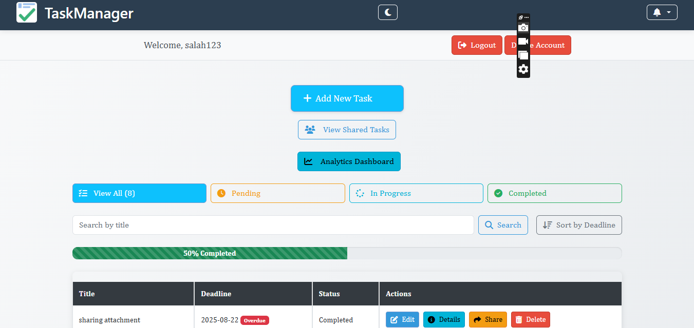
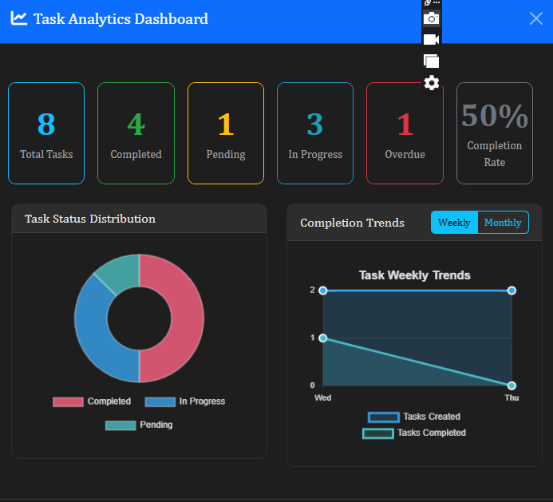
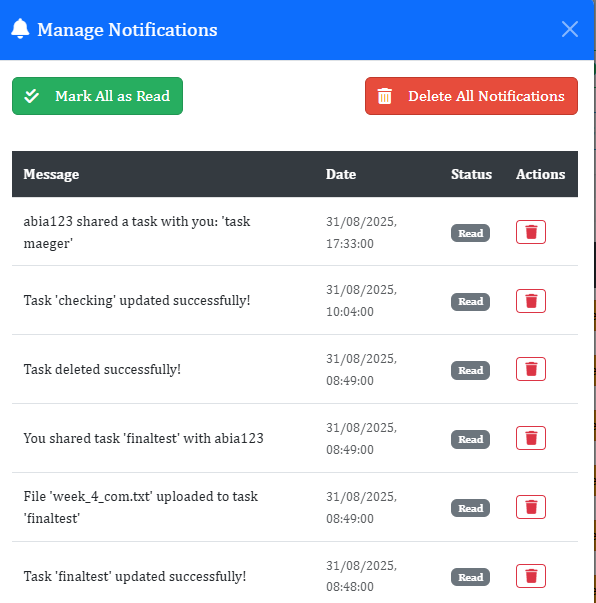
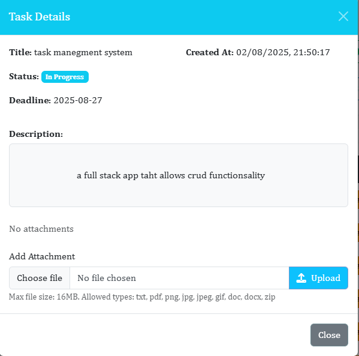

# Task Manager 📋 - Modern Task Management System

A modern Task Management System built with Flask (backend), MongoDB Atlas (database), and HTML/CSS/JavaScript with Bootstrap for the frontend.
It supports task management, real-time collaboration, notifications, and an analytics dashboard for productivity insights.

🚀 Features

🔹 User & Authentication

User registration and login.

Secure session handling.

Delete Account 

🔹 Task Management

Create, edit, update, and delete tasks.

Task status tracking: Pending, In Progress, Completed.

Due date management.

Attachments (upload files and images).

🔹 Collaboration

Share tasks with other registered users.

View tasks shared with you.

🔹 Real-Time Notifications

Instant alerts using Flask-SocketIO.

Notifications when:

A task is shared with a user.

Any operation is performed on task.

A proper record of the past notifications.

🔹 Analytics Dashboard

Overview of task activity: created, completed, pending.

Weekly and monthly trends.

Status breakdown visualized in pie and bar charts.

Powered by Chart.js with real-time data from the backend.

🔹 UI Enhancements

Dark mode toggle.

Mobile responsive layout with Bootstrap.

Clean and simple user experience.

🛠️ Tech Stack

Backend: Flask, Flask-SocketIO, Gunicorn

Frontend: HTML, CSS, JavaScript, Bootstrap

Database: MongoDB Atlas

Visualizations: Chart.js

⚙️ Installation & Setup
1. Clone the repository
git clone https://github.com/abdullah25-23/Task-Management-System.git
cd Task-Management-System

2. Create virtual environment & activate
python -m venv venv
venv\Scripts\activate   # On Windows
source venv/bin/activate # On Mac/Linux

3. Install dependencies
pip install -r requirements.txt

4. Setup environment variables

Create a .env file (or export variables) with:

MONGO_URI=your_mongodb_connection_string
SECRET_KEY=your_secret_key

5. Run the application
python app.py

App runs on: http://127.0.0.1:5000

📡 API Documentation

🔹 Tasks

POST /tasks → Create a new task

GET /tasks → Get all tasks for a user

PUT /tasks/:id → Update task by ID

DELETE /tasks/:id → Delete task by ID

🔹 Collaboration

PUT /tasks/:id/share → Share task with another user

GET /tasks/shared → Retrieve tasks shared with current user

🔹 Notifications

Real-time notifications via Socket.IO events.

GET /notifications → Fetch all past notifications

🔹 Analytics

GET /analytics/overview → Summary stats (total, pending, completed)

GET /analytics/trends → Weekly/monthly trends

📸 Screenshots

## 📸 Screenshots  

### Dashboard  
  

### Analytical Dashboard  
  

### Notifications  
  

### Delete Account  
  

### Task Details  
  

## 🎥 Demo Video  
[Watch the Demo Video here](https://drive.google.com/file/d/1yPd3WvWzMDRf-S8UdSPP-O0sIu-ZOqbH/view?usp=drive_link)

